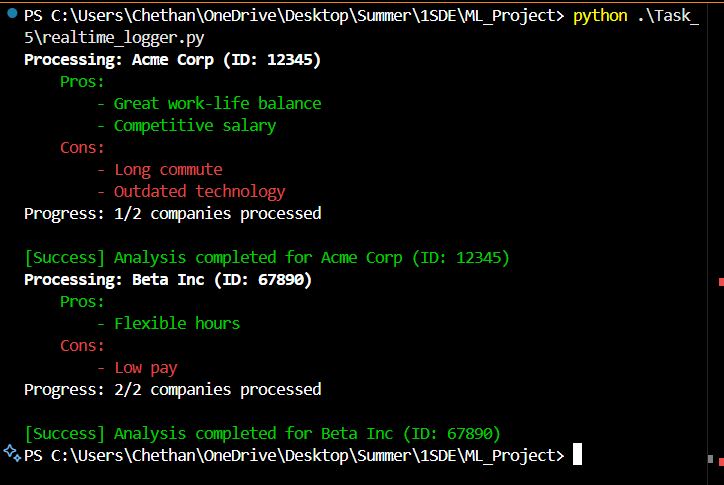
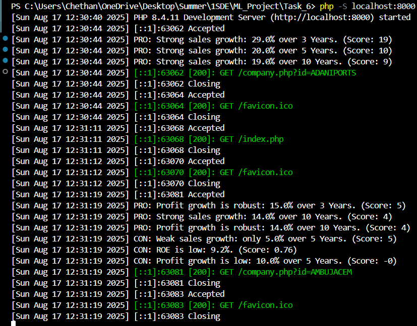
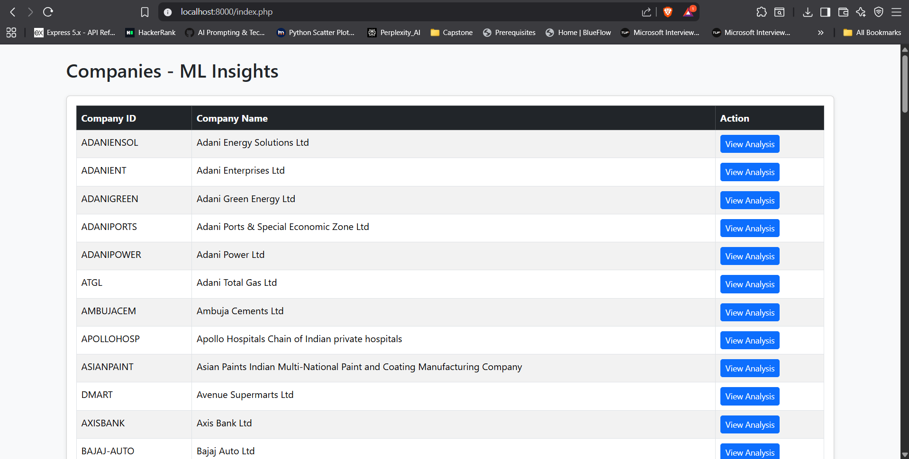
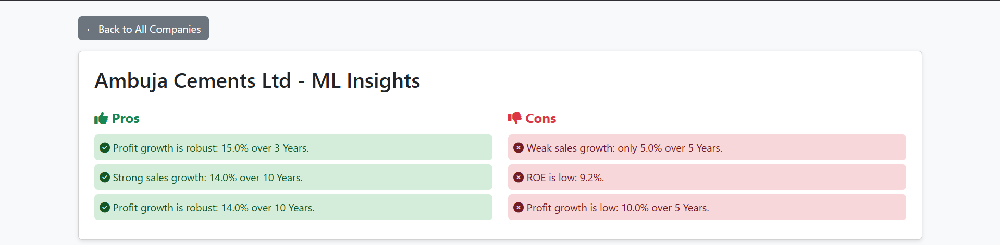

# ML Project: End-to-End Pipeline

## Overview
This project provides a complete machine learning pipeline for company analysis, including data fetching, ML analysis, MySQL storage, real-time CLI logging, and a dynamic web frontend.

---

## Table of Contents
- [Pipeline Overview](docs/pipeline_overview.md)
- [Setup Guide](docs/setup_guide.md)
- [Usage Guide](docs/usage_guide.md)
- [Contributing](docs/contributing.md)
- [Screenshots](#screenshots)
- [Sample API/JSON Response](#sample-jsonapi-response)
- [ML Table Schema](#ml-table-schema)
- [Scripts & SQL Dumps](#scripts--sql-dumps)

---

## Pipeline Steps
1. **Fetch Data:** Use provided scripts to fetch and preprocess company data.
2. **Run Analysis:** Execute ML scripts to generate analysis results.
3. **Store in MySQL:** Use upsert scripts to save results in the `ml` table.
4. **View Results:**
    - **Terminal:** Real-time CLI with color-coded output and logging.
    - **Web Frontend:** Dynamic company analysis and list view.

---

## How to Run
1. **Set up MySQL** using the schema in [`docs/ml_table_schema.sql`](docs/ml_table_schema.sql).
2. **Install Python dependencies** (see `requirements.txt`).
3. **Run analysis and upsert scripts** (see [`scripts/`](scripts/) or project root).
4. **Start the PHP server** for the frontend:
   ```powershell
   cd Task_6
   php -S localhost:8000
   ```
5. **Open** [http://localhost:8000](http://localhost:8000) in your browser.

---

## Screenshots
- **Terminal Run:** 
- **Terminal Logger:** 
- **Web Frontend (Company):** 
- **Web Frontend (List):** 

---

## Sample JSON/API Response
See [`docs/sample_api_response.json`](docs/sample_api_response.json)

---

## ML Table Schema
See [`docs/ml_table_schema.sql`](docs/ml_table_schema.sql)

---

## Scripts & SQL Dumps
- All main scripts are in the project root or [`scripts/`](scripts/) folder:
    - `save_ml_results_tailored.py` — Upserts ML results into MySQL
    - `realtime_logger.py` — Real-time CLI logger
    - `fetch_data.py`, `data_preprocessing.py`, etc. — Data pipeline scripts
- SQL dumps:
    - [`ml.sql`](ml.sql) — Full database structure and sample data
    - [`docs/ml_table_schema.sql`](docs/ml_table_schema.sql) — Only the `ml` table schema

---

## Contributing
See [`docs/contributing.md`](docs/contributing.md) for guidelines on setup, coding standards, and submitting changes.

---

## Credits
- Project by [Your Name/Team]
- For onboarding, see the ZIP package and this documentation.
