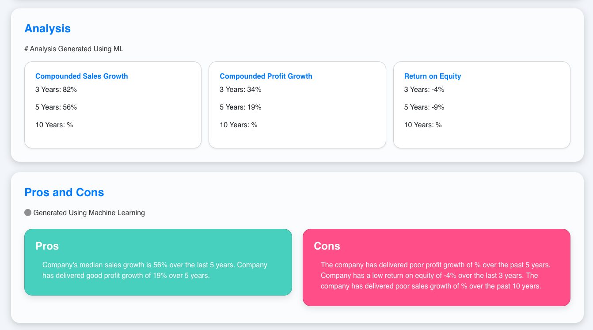

# Machine Learning Financial Analysis Project

## Documentation for Interns

Welcome to the ML Financial Analysis Project! This guide provides an overview of the project, including API usage, workflow, deliverables, and resources for new team members.

---

## Table of Contents

- [Project Overview](#project-overview)
- [Tech Stack](#tech-stack)
- [Data Source](#data-source)
- [API Documentation](#api-documentation)
- [Project Workflow](#project-workflow)
- [Database Schema](#database-schema)
- [Frontend Web App](#frontend-web-app)
- [Project Deliverables](#project-deliverables)
- [Next Steps](#next-steps)

---

## Project Overview

This project automates the process of fetching financial data (Balance Sheet, Profit & Loss, Cash Flow) from an API, applies machine learning to generate actionable insights, and stores results in a MySQL database. Real-time analysis is displayed both in the terminal and on a web interface for easy access and visualization.

---

## Tech Stack

- **Programming Language:** Python
- **Database:** MySQL
- **Tools:** VS Code
- **Packages:** Pandas, Requests, SQLAlchemy, Scikit-learn
- **Frontend:** Custom web app for real-time analysis

---

## Data Source

- **API Base URL:** [`https://bluemutualfund.in/server/api/company.php`](https://bluemutualfund.in/server/api/company.php)
- **Company List:** Provided in the `Nifty100Companies` Excel file.

[Download Company List](company_id.xlsx) <!-- Local file: company_id.xlsx in project directory -->

---

## API Documentation

- **Endpoint:** `GET https://bluemutualfund.in/server/api/company.php`
- **Parameters:**
    - `id={company_id}` (e.g., TCS, HDFCBANK, DMART)
    - `api_key=ghfkffu6378382826hhdjgk`
- **Sample Call:**  
    `https://bluemutualfund.in/server/api/company.php?id=TCS&api_key=ghfkffu6378382826hhdjgk`

> **Note:** Use the provided API key and replace `{company_id}` with valid IDs from the company list.

---

## Project Workflow

1. **Fetch Financial Data:**  
     Retrieve Balance Sheet, Profit & Loss, and Cash Flow statements for each company via the API.

2. **Perform Machine Learning Operations:**  
     Analyze financial data and categorize metrics into:
     - **Pros (values > 10%)**  
         - Debt-free status
         - Reduced debt
         - Strong ROE (e.g., 3 Years ROE 47.4%)
         - Healthy dividend payout (e.g., 66.2%)
         - Good profit growth (e.g., 23.0%)
         - Strong median sales growth (e.g., 28.3% over 10 years)
     - **Cons (values < 10%)**  
         - Poor sales growth (e.g., 9.5% over 5 years)
         - No dividend payout
         - Low ROE (e.g., 8.33% over 3 years)
     - Select up to 3 pros and cons per company.

3. **Store Results in MySQL:**  
     Save insights, pros, and cons in the pre-existing `ml` table.

4. **Display Real-time Analysis:**  
     Output results to the terminal and web page for monitoring.

5. **Sample Output:**  
    

---

## Database Schema

- **Table Name:** `ml` (pre-existing)

[Download Database Schema](ml.sql) <!-- Local file: ml.sql in project directory -->

---

## Frontend Web App

- **Live URL:** [https://bluemutualfund.in/app1/](https://bluemutualfund.in/app1/)
- **Company Analysis:** [https://bluemutualfund.in/app1/pages/company.php?id={company_id}](https://bluemutualfund.in/app1/pages/company.php?id={company_id})
- **View All Companies:** [https://bluemutualfund.in/app1/view_all.html](https://bluemutualfund.in/app1/view_all.html)

**Features:**
- Display financial analysis for individual companies
- Compare multiple companies

---

## Project Deliverables

- **Python Scripts:** For data fetching, ML analysis, and MySQL storage
- **Web Page:** Displays ML-generated insights (visible after analyzing 100 companies)
- **Database Integration:** MySQL storage for analysis results
- **Documentation:** This guide for team collaboration

---

## Next Steps

1. Implement Python scripts for API fetching and ML operations.
2. Develop the web interface for real-time analysis.
3. Test and optimize ML models for accurate financial forecasting.

---